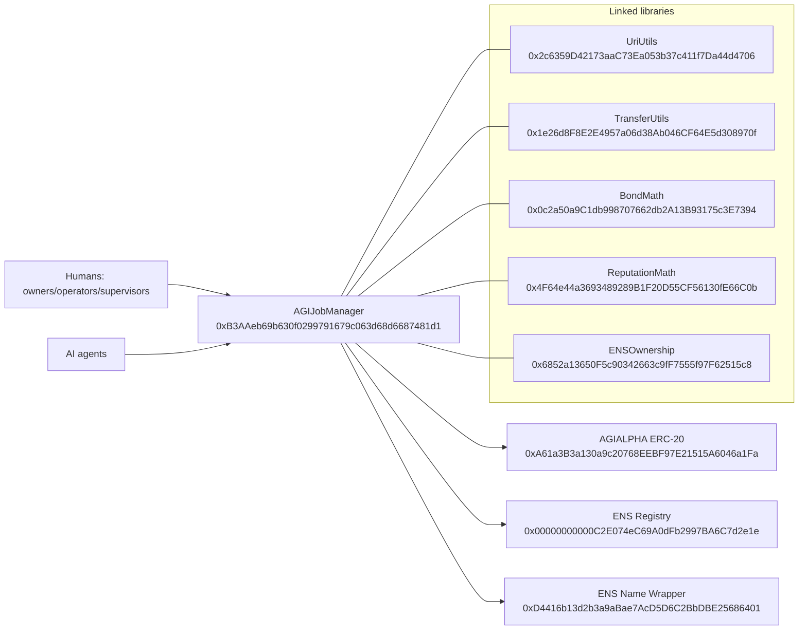

# Official Mainnet Deployment Record

## 1) Executive overview

This document is the canonical deployment record for the official AGIJobManager release on Ethereum Mainnet (`chainId = 1`).

What was deployed:
- One primary contract: `AGIJobManager`
- Five linked libraries: `UriUtils`, `TransferUtils`, `BondMath`, `ReputationMath`, `ENSOwnership`

What “official” means:
- The addresses in this document are the canonical production addresses for this release.
- Any different address is non-official unless a newer in-repo record explicitly supersedes this one.

**Intended use: this system is intended for AI agents exclusively. Humans are owners/operators/supervisors.**

Legal notice:
- The governing Terms are embedded in the header of `contracts/AGIJobManager.sol`.
- This document summarizes operations and verification only. It does not replace those Terms.

## 2) What you can trust (anti-phishing)

These are the only official mainnet addresses in this release record.

How to detect impostors:
- Wrong chain: anything other than Ethereum Mainnet (`chainId = 1`) is wrong.
- Wrong address: any contract address mismatch is wrong.
- Proxy mismatch: this record is a direct verified deployment record, not a proxy deployment record.

Why libraries exist:
- Solidity links library bytecode addresses into the main contract at compile/link time.
- Libraries are support components. Owners/operators should interact with `AGIJobManager`, not library contracts directly.

## 3) Quick links

- UriUtils: https://etherscan.io/address/0x2c6359D42173aaC73Ea053b37c411f7Da44d4706#code
- TransferUtils: https://etherscan.io/address/0x1e26d8F8E2E4957a06d38Ab046CF64E5d308970f#code
- BondMath: https://etherscan.io/address/0x0c2a50a9C1db998707662db2A13B93175c3E7394#code
- ReputationMath: https://etherscan.io/address/0x4F64e44a3693489289B1F20D55CF56130fE66C0b#code
- ENSOwnership: https://etherscan.io/address/0x6852a13650F5c90342663c9fF7555f97F62515c8#code
- AGIJobManager: https://etherscan.io/address/0xB3AAeb69b630f0299791679c063d68d6687481d1#code
- AGIALPHA token context: https://etherscan.io/address/0xA61a3B3a130a9c20768EEBF97E21515A6046a1Fa

## 4) Contract registry table

Network:
- Ethereum Mainnet (`chainId = 1`)

Deployer (EOA):
- `0x6c8B8897Fb6b08B4070387233B89b3E9A94eD00E`
- ENS label (informational): `deployer.agi.eth`

Final owner (after transfer):
- `0xa9eD0539c2fbc5C6BC15a2E168bd9BCd07c01201`
- ENS label (informational): `club.agi.eth`

| Contract | Address (checksummed) | ENS label (if applicable) | Deployment tx hash | Etherscan #code link | Purpose | Do I ever call this? |
|---|---|---|---|---|---|---|
| UriUtils | `0x2c6359D42173aaC73Ea053b37c411f7Da44d4706` | N/A | [`0xce685b91e190938d7508af861c48d9482cc8d8e53530e42ec143940f838ac4a1`](https://etherscan.io/tx/0xce685b91e190938d7508af861c48d9482cc8d8e53530e42ec143940f838ac4a1) | https://etherscan.io/address/0x2c6359D42173aaC73Ea053b37c411f7Da44d4706#code | URI helper logic linked into AGIJobManager. | No |
| TransferUtils | `0x1e26d8F8E2E4957a06d38Ab046CF64E5d308970f` | N/A | [`0x4847d58a96191427c5cb2b89622fee4882f03bad4e85eff5fc1a55fc5c7fe4c3`](https://etherscan.io/tx/0x4847d58a96191427c5cb2b89622fee4882f03bad4e85eff5fc1a55fc5c7fe4c3) | https://etherscan.io/address/0x1e26d8F8E2E4957a06d38Ab046CF64E5d308970f#code | Transfer safety logic linked into AGIJobManager. | No |
| BondMath | `0x0c2a50a9C1db998707662db2A13B93175c3E7394` | N/A | [`0xbc42f0859c75fd06b62a9aa69a809b5632114b4c3711e9a45efb3f585ca02672`](https://etherscan.io/tx/0xbc42f0859c75fd06b62a9aa69a809b5632114b4c3711e9a45efb3f585ca02672) | https://etherscan.io/address/0x0c2a50a9C1db998707662db2A13B93175c3E7394#code | Bond and escrow math linked into AGIJobManager. | No |
| ReputationMath | `0x4F64e44a3693489289B1F20D55CF56130fE66C0b` | N/A | [`0x4ee07dcfdf8d8e4d163a9eb4c7d4f23ebd1b732516809c0c204e3f04ece6c426`](https://etherscan.io/tx/0x4ee07dcfdf8d8e4d163a9eb4c7d4f23ebd1b732516809c0c204e3f04ece6c426) | https://etherscan.io/address/0x4F64e44a3693489289B1F20D55CF56130fE66C0b#code | Reputation math linked into AGIJobManager. | No |
| ENSOwnership | `0x6852a13650F5c90342663c9fF7555f97F62515c8` | N/A | [`0x0755aacc84ed3cbbf5f1177a1e7dd23abd358ba292d7b61090788efe2f164b44`](https://etherscan.io/tx/0x0755aacc84ed3cbbf5f1177a1e7dd23abd358ba292d7b61090788efe2f164b44) | https://etherscan.io/address/0x6852a13650F5c90342663c9fF7555f97F62515c8#code | ENS ownership validation logic linked into AGIJobManager. | No |
| AGIJobManager | `0xB3AAeb69b630f0299791679c063d68d6687481d1` | N/A | [`0x5b99dc902229561d52b0f0daa7207372f12866befbdbe03a701a07c7e2690995`](https://etherscan.io/tx/0x5b99dc902229561d52b0f0daa7207372f12866befbdbe03a701a07c7e2690995) | https://etherscan.io/address/0xB3AAeb69b630f0299791679c063d68d6687481d1#code | Primary escrow, lifecycle, dispute, and settlement contract. | Yes |

## 5) Build + verification settings (verbatim)

- solc 0.8.23
- optimizer enabled, runs = 40
- evmVersion = shanghai
- viaIR = false
- settings.metadata.bytecodeHash = "none"
- settings.debug.revertStrings = "strip"

Why this matters:
- Etherscan recompiles from source for verification.
- Any setting mismatch can produce “bytecode mismatch” or failed verification.

## 6) AGIJobManager constructor arguments (verbatim)

- agiTokenAddress: 0xa61a3b3a130a9c20768eebf97e21515a6046a1fa
- baseIpfsUrl: https://ipfs.io/ipfs/
- ensConfig (address[2]):
  [0x00000000000C2E074eC69A0dFb2997BA6C7d2e1e, 0xD4416b13d2b3a9aBae7AcD5D6C2BbDBE25686401]
- rootNodes (bytes32[4]):
  0x39eb848f88bdfb0a6371096249dd451f56859dfe2cd3ddeab1e26d5bb68ede16
  0x2c9c6189b2e92da4d0407e9deb38ff6870729ad063af7e8576cb7b7898c88e2d
  0x6487f659ec6f3fbd424b18b685728450d2559e4d68768393f9c689b2b6e5405e
  0xc74b6c5e8a0d97ed1fe28755da7d06a84593b4de92f6582327bc40f41d6c2d5e
- merkleRoots (bytes32[2]):
  0x0effa6c54d4c4866ca6e9f4fc7426ba49e70e8f6303952e04c8f0218da68b99b
  0x0effa6c54d4c4866ca6e9f4fc7426ba49e70e8f6303952e04c8f0218da68b99b

Plain-language meaning:
- `agiTokenAddress`: AGIALPHA ERC-20 token used for escrow/settlement (`0xA61a3B3a130a9c20768EEBF97E21515A6046a1Fa`).
- `baseIpfsUrl`: base URL used to resolve IPFS-hosted metadata paths.
- `ensConfig`: ENS Registry and ENS Name Wrapper addresses used for ENS identity checks.
- `rootNodes` and `merkleRoots`: allowlist/gating anchors for namespace and permission checks at a high level.

## 7) Ownership and roles (verifiable on Etherscan)

- Deployer (`deployer.agi.eth`, informational): `0x6c8B8897Fb6b08B4070387233B89b3E9A94eD00E`
  - Role: account that broadcast deployment transactions.
- Final owner (`club.agi.eth`, informational): `0xa9eD0539c2fbc5C6BC15a2E168bd9BCd07c01201`
  - Role: account controlling owner-only functions after transfer.
- Ownership transfer tx:
  - `0xbabede7945b7e926cf0ea4a66561bf5db9952648425290608c02f970dcab5436`

What you do / What you should see:

1) Owner check
- What you do: Open `https://etherscan.io/address/0xB3AAeb69b630f0299791679c063d68d6687481d1#readContract` and call `owner()`.
- What you should see: `0xa9eD0539c2fbc5C6BC15a2E168bd9BCd07c01201`.

2) Token binding check
- What you do: On the same read page, call `agiToken()`.
- What you should see: `0xA61a3B3a130a9c20768EEBF97E21515A6046a1Fa`.

3) Ownership transfer check
- What you do: Open `https://etherscan.io/tx/0xbabede7945b7e926cf0ea4a66561bf5db9952648425290608c02f970dcab5436`.
- What you should see: successful ownership transfer to the final owner.

Note: ENS labels help humans. Addresses are authoritative.

## 8) Etherscan verification checklist (step-by-step)

1) Confirm network
- What you do: Check network header and URL.
- What you should see: Ethereum Mainnet (`chainId = 1`).

2) Confirm contract page type
- What you do: Open each address and inspect tabs.
- What you should see: contract page with code; not a token-only page; no unexpected proxy indirection.

3) Confirm verified source
- What you do: Open `Contract` tab.
- What you should see: `Contract Source Code Verified`.

4) Confirm constructor args
- What you do: Inspect constructor arguments in verification details.
- What you should see: exact match with Section 6.

5) Confirm linked libraries for AGIJobManager
- What you do: Inspect linked library map in verification details.
- What you should see:
  - `contracts/utils/UriUtils.sol:UriUtils` -> `0x2c6359D42173aaC73Ea053b37c411f7Da44d4706`
  - `contracts/utils/TransferUtils.sol:TransferUtils` -> `0x1e26d8F8E2E4957a06d38Ab046CF64E5d308970f`
  - `contracts/utils/BondMath.sol:BondMath` -> `0x0c2a50a9C1db998707662db2A13B93175c3E7394`
  - `contracts/utils/ReputationMath.sol:ReputationMath` -> `0x4F64e44a3693489289B1F20D55CF56130fE66C0b`
  - `contracts/utils/ENSOwnership.sol:ENSOwnership` -> `0x6852a13650F5c90342663c9fF7555f97F62515c8`

6) Confirm creator transactions
- What you do: Open each contract page and inspect creator tx.
- What you should see:
  - UriUtils: `0xce685b91e190938d7508af861c48d9482cc8d8e53530e42ec143940f838ac4a1`
  - TransferUtils: `0x4847d58a96191427c5cb2b89622fee4882f03bad4e85eff5fc1a55fc5c7fe4c3`
  - BondMath: `0xbc42f0859c75fd06b62a9aa69a809b5632114b4c3711e9a45efb3f585ca02672`
  - ReputationMath: `0x4ee07dcfdf8d8e4d163a9eb4c7d4f23ebd1b732516809c0c204e3f04ece6c426`
  - ENSOwnership: `0x0755aacc84ed3cbbf5f1177a1e7dd23abd358ba292d7b61090788efe2f164b44`
  - AGIJobManager: `0x5b99dc902229561d52b0f0daa7207372f12866befbdbe03a701a07c7e2690995`

7) Confirm ownership finalization
- What you do: Open transfer tx and call `owner()`.
- What you should see: transfer tx exists and `owner()` equals final owner.

## 9) Architecture diagram (text-only Mermaid)

## 10) Long-term recordkeeping and reproducibility

Official deployment artifacts are committed using repository-relative paths:
- `hardhat/deployments/mainnet/deployment.1.24522684.json`
- `hardhat/deployments/mainnet/solc-input.json`
- `hardhat/deployments/mainnet/verify-targets.json`

Why this matters:
- `deployment.1.24522684.json` is the deployment receipt with addresses, tx hashes, constructor args, library map, and ownership transfer.
- `solc-input.json` is the Solidity Standard JSON Input needed for durable manual verification on Etherscan.
- `verify-targets.json` is the contract FQN-to-address index for reproducible verification tooling.

If plugin automation breaks in future years, operators can still verify manually with these committed artifacts.

Do not rely on private machine paths. Use only repo-relative paths in permanent records.

---

## Canonical source data snapshot (verbatim)

Network:
- Ethereum Mainnet (chainId = 1)

Deployer (EOA):
- 0x6c8B8897Fb6b08B4070387233B89b3E9A94eD00E
ENS label (informational):
- deployer.agi.eth

Final owner (after transferOwnership):
- 0xa9eD0539c2fbc5C6BC15a2E168bd9BCd07c01201
ENS label (informational):
- club.agi.eth

Compiler / verification settings:
- solc 0.8.23
- optimizer enabled, runs = 40
- evmVersion = shanghai
- viaIR = false
- settings.metadata.bytecodeHash = "none"
- settings.debug.revertStrings = "strip"

Constructor args used for AGIJobManager (must appear verbatim in docs):
- agiTokenAddress: 0xa61a3b3a130a9c20768eebf97e21515a6046a1fa
- baseIpfsUrl: https://ipfs.io/ipfs/
- ensConfig (address[2]):
  [0x00000000000C2E074eC69A0dFb2997BA6C7d2e1e, 0xD4416b13d2b3a9aBae7AcD5D6C2BbDBE25686401]
- rootNodes (bytes32[4]):
  0x39eb848f88bdfb0a6371096249dd451f56859dfe2cd3ddeab1e26d5bb68ede16
  0x2c9c6189b2e92da4d0407e9deb38ff6870729ad063af7e8576cb7b7898c88e2d
  0x6487f659ec6f3fbd424b18b685728450d2559e4d68768393f9c689b2b6e5405e
  0xc74b6c5e8a0d97ed1fe28755da7d06a84593b4de92f6582327bc40f41d6c2d5e
- merkleRoots (bytes32[2]):
  0x0effa6c54d4c4866ca6e9f4fc7426ba49e70e8f6303952e04c8f0218da68b99b
  0x0effa6c54d4c4866ca6e9f4fc7426ba49e70e8f6303952e04c8f0218da68b99b

Token context (explain clearly; do not change constructor args):
- AGIALPHA ERC‑20: 0xA61a3B3a130a9c20768EEBF97E21515A6046a1Fa

Deployed contracts (addresses + tx hashes; links must be shown in docs):
- UriUtils:
  address: 0x2c6359D42173aaC73Ea053b37c411f7Da44d4706
  tx:      0xce685b91e190938d7508af861c48d9482cc8d8e53530e42ec143940f838ac4a1
  etherscan: https://etherscan.io/address/0x2c6359D42173aaC73Ea053b37c411f7Da44d4706#code
- TransferUtils:
  address: 0x1e26d8F8E2E4957a06d38Ab046CF64E5d308970f
  tx:      0x4847d58a96191427c5cb2b89622fee4882f03bad4e85eff5fc1a55fc5c7fe4c3
  etherscan: https://etherscan.io/address/0x1e26d8F8E2E4957a06d38Ab046CF64E5d308970f#code
- BondMath:
  address: 0x0c2a50a9C1db998707662db2A13B93175c3E7394
  tx:      0xbc42f0859c75fd06b62a9aa69a809b5632114b4c3711e9a45efb3f585ca02672
  etherscan: https://etherscan.io/address/0x0c2a50a9C1db998707662db2A13B93175c3E7394#code
- ReputationMath:
  address: 0x4F64e44a3693489289B1F20D55CF56130fE66C0b
  tx:      0x4ee07dcfdf8d8e4d163a9eb4c7d4f23ebd1b732516809c0c204e3f04ece6c426
  etherscan: https://etherscan.io/address/0x4F64e44a3693489289B1F20D55CF56130fE66C0b#code
- ENSOwnership:
  address: 0x6852a13650F5c90342663c9fF7555f97F62515c8
  tx:      0x0755aacc84ed3cbbf5f1177a1e7dd23abd358ba292d7b61090788efe2f164b44
  etherscan: https://etherscan.io/address/0x6852a13650F5c90342663c9fF7555f97F62515c8#code
- AGIJobManager:
  address: 0xB3AAeb69b630f0299791679c063d68d6687481d1
  tx:      0x5b99dc902229561d52b0f0daa7207372f12866befbdbe03a701a07c7e2690995
  etherscan: https://etherscan.io/address/0xB3AAeb69b630f0299791679c063d68d6687481d1#code

Ownership transfer (must be recorded and explained):
- transferOwnership(finalOwner) tx:
  0xbabede7945b7e926cf0ea4a66561bf5db9952648425290608c02f970dcab5436

Deployment artifacts produced (must be referenced using REPO‑RELATIVE paths, not local absolute paths):
- hardhat/deployments/mainnet/deployment.1.24522684.json
- hardhat/deployments/mainnet/solc-input.json
- hardhat/deployments/mainnet/verify-targets.json
