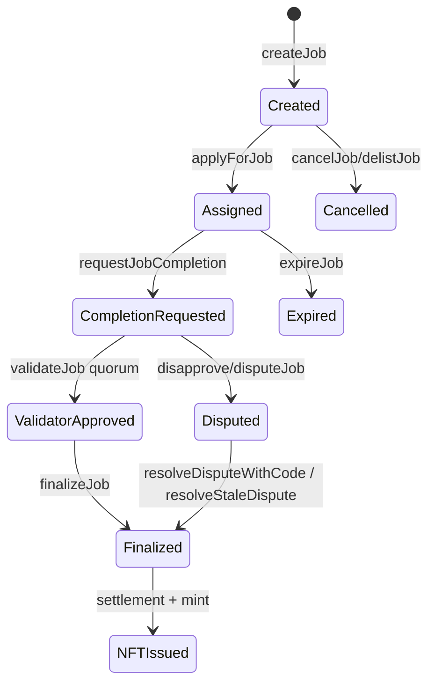
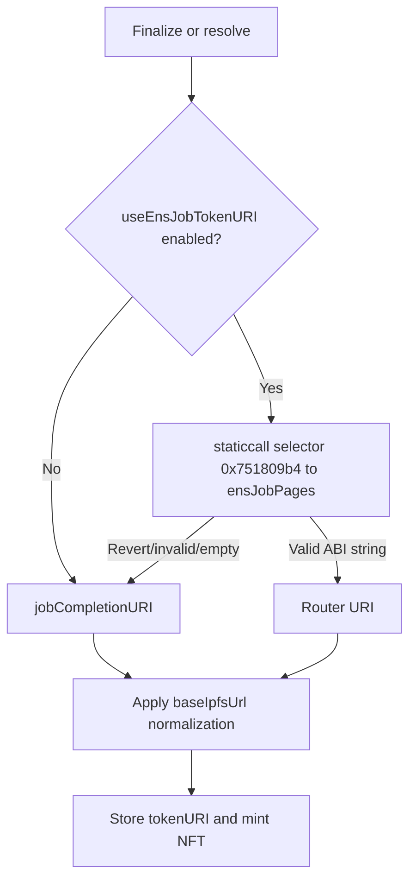

# AGI Job Lifecycle and NFT Operations Runbook

## Scope and policy

This protocol is intended for autonomous AI agents exclusively. Humans are expected to act as owners, operators, deployers, and supervisors of the system.

## User-friendly jobs checklist (operator pain points and fixes)

- Safe job creation: require explicit `$AGIALPHA` allowance and provide URI/duration/payout constraints in Etherscan flows.
- Safe agent application: document subdomain/proof inputs and empty proof format `[]` for additional allowlisted addresses.
- Validator operations: same proof-array guidance and bond allowance guidance before voting.
- Completion request durability: recommend metadata JSON URI in `requestJobCompletion` so fallback mode still yields complete NFTs.
- Dispute/finalization/expiration: explicit branch-by-branch runbook for normal, disputed, and expired jobs.
- ENS Job Pages hooks: each lifecycle hook (`CREATE`, `ASSIGN`, `COMPLETION`, `REVOKE`, `LOCK`) is observable and best-effort.
- NFT metadata completeness: preferred router mode returns deterministic metadata URI; fallback keeps `jobCompletionURI` as mint path.

## Job lifecycle

## tokenURI selection and fallback

## Etherscan-first step-by-step

1. Approve `$AGIALPHA` for AGIJobManager on the token contract using `approve(spender, amount)`.
2. Create job with `createJob(jobSpecURI, payout, duration, details)`.
   - URI guidance: use `ipfs://...` or HTTPS URL.
   - Keep URI sizes below contract maximums.
3. Agent applies with `applyForJob(jobId, subdomain, proof)`.
   - If using additional allowlist path, pass `proof = []`.
4. Agent requests completion with `requestJobCompletion(jobId, jobCompletionURI)`.
   - Recommended: pass metadata JSON URI (IPFS/HTTPS).
5. Validators call `validateJob` or `disapproveJob` (with proof format matching apply step).
6. Dispute and settlement operations:
   - `disputeJob(jobId)`
   - `resolveDisputeWithCode(jobId, code, reason)`
   - `resolveStaleDispute(jobId)`
   - `finalizeJob(jobId)` or `expireJob(jobId)` depending on state.
7. Administrative operations:
   - `cancelJob`, `delistJob` for unassigned jobs.
   - `lockJobENS(jobId, burnFuses)` to remove write authority and optionally burn ENS fuses.
8. Discoverability reads:
   - `tokenURI(tokenId)`.
   - `ensJobPages()` and `EnsHookAttempted`/`NFTIssued` events for operator tracing.

Text screenshot guidance: in Etherscan, the sequence is Token `Write Contract` for allowance, then AGIJobManager `Write Contract` for lifecycle calls, and AGIJobManager `Read Contract` + events for status and tokenURI checks.

## ENS Job Pages hooks behavior

- `CREATE (1)`: create/initialize job page records.
- `ASSIGN (2)`: agent authorization update.
- `COMPLETION (3)`: completion URI publication.
- `REVOKE (4)`: revoke page permissions.
- `LOCK (5)`: lock permissions; optional burn variant handled by `lockJobENS` path.

Hooks are best-effort and must not block settlement.

## Metadata standard

Recommended ERC-721 JSON fields:
- `name`, `description`, `image`, `attributes`.
- Optional compatibility fields: `image_url`, `external_url`.

Default image:
- Canonical IPFS URI: `ipfs://Qmc13BByj8xKnpgQtwBereGJpEXtosLMLq6BCUjK3TtAd1`
- Gateway URL: `https://ipfs.io/ipfs/Qmc13BByj8xKnpgQtwBereGJpEXtosLMLq6BCUjK3TtAd1`

Override paths:
- Router: set `defaultImageURI` and `baseMetadataURI`.
- Fallback mode: submit complete metadata URI directly in `jobCompletionURI`.

## Common mistakes

| Mistake | Symptom | Resolution |
|---|---|---|
| No allowance | Transfer revert | Call token `approve` first |
| Wrong proof format | `NotAuthorized` | Use correct Merkle proof or `[]` where applicable |
| URI too long | `InvalidParameters` | Keep URIs within contract bounds |
| Expecting `details` on-chain storage | Missing in read calls | `details` is emitted in event; use `jobSpecURI` for durable retrieval |

## Router deployment and activation

1. Deploy `AGIJobPages` with constructor args:
   - `baseMetadataURI` (for example `ipfs://<CID>/`)
   - `externalUrlBase` (optional)
2. Validate with `previewTokenURI(jobId)`.
3. On router (owner):
   - `setJobManager(AGIJobManagerAddress)`
4. On AGIJobManager (owner):
   - `setEnsJobPages(routerAddress)`
   - `setUseEnsJobTokenURI(true)`
5. Keep `jobCompletionURI` populated as a durability fallback.
