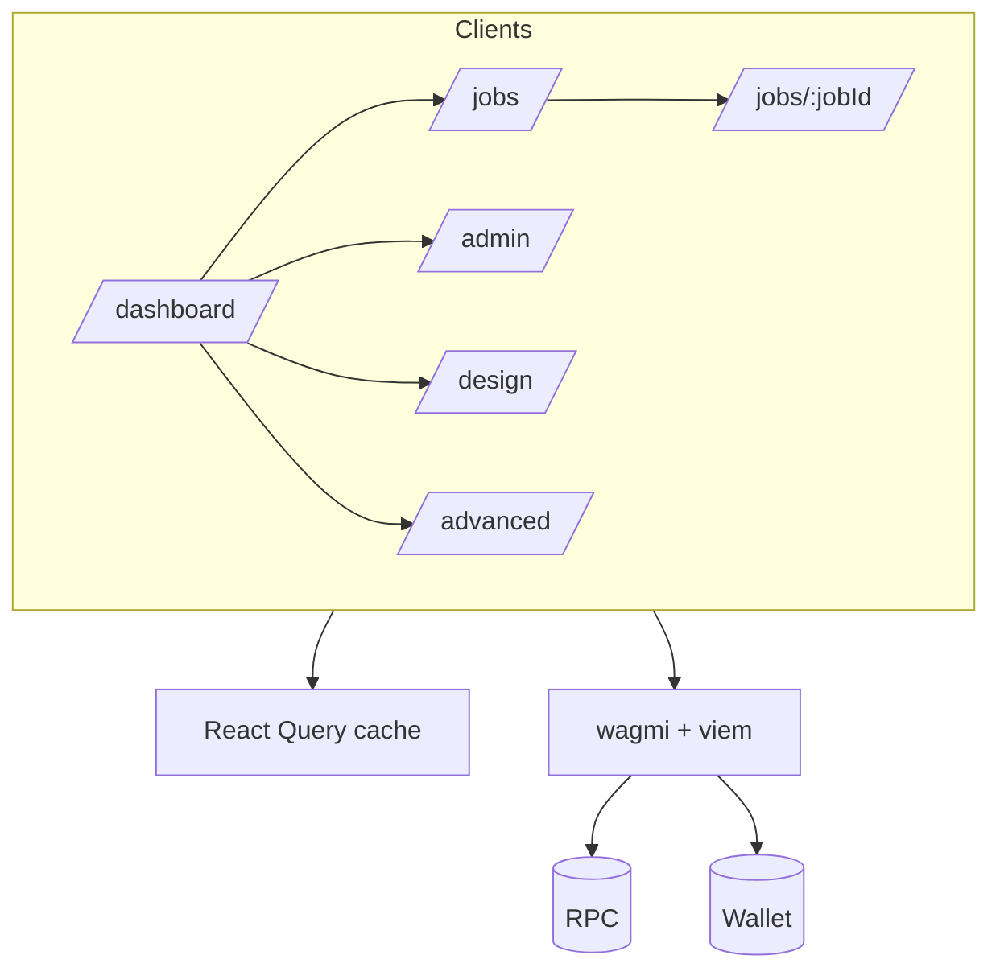
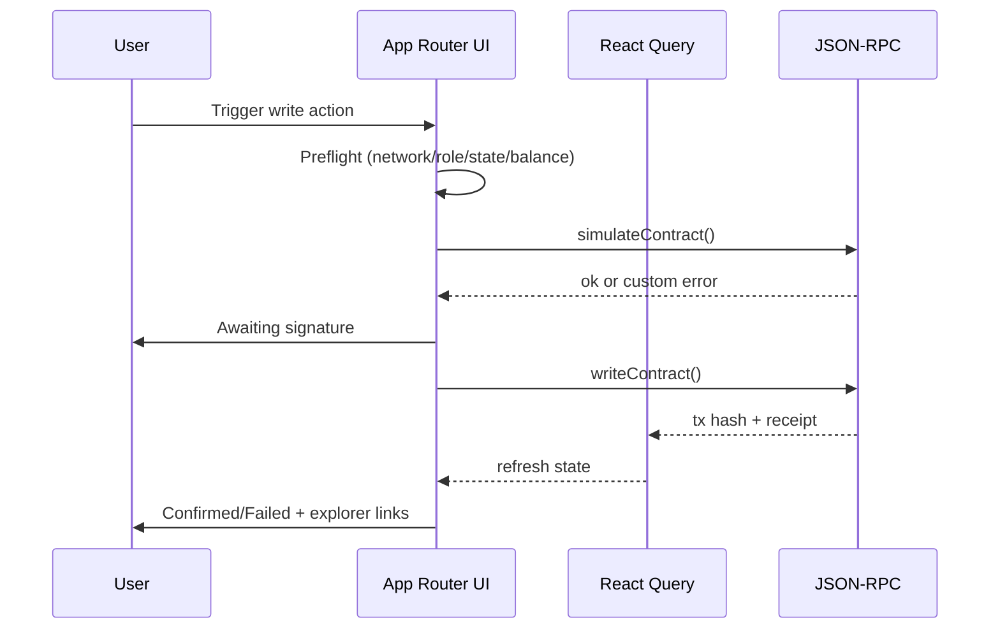

# UI Architecture

```mermaid
flowchart TD
  A[/dashboard/] --> B[/jobs/]
  B --> C[/jobs/:jobId/]
  A --> D[/admin/]
  A --> E[/design/]
  A --> F[/advanced/]
  subgraph Clients
    A
    B
    C
    D
    E
    F
  end
  Clients --> Q[React Query cache]
  Clients --> W[wagmi + viem]
  W --> R[(RPC)]
  W --> X[(Wallet)]
```

```mermaid
sequenceDiagram
  participant U as User
  participant UI as App Router UI
  participant RQ as React Query
  participant RPC as JSON-RPC
  U->>UI: Trigger write action
  UI->>UI: Preflight (network/role/state/balance)
  UI->>RPC: simulateContract()
  RPC-->>UI: ok or custom error
  UI->>U: Awaiting signature
  UI->>RPC: writeContract()
  RPC-->>RQ: tx hash + receipt
  RQ-->>UI: refresh state
  UI->>U: Confirmed/Failed + explorer links
```
