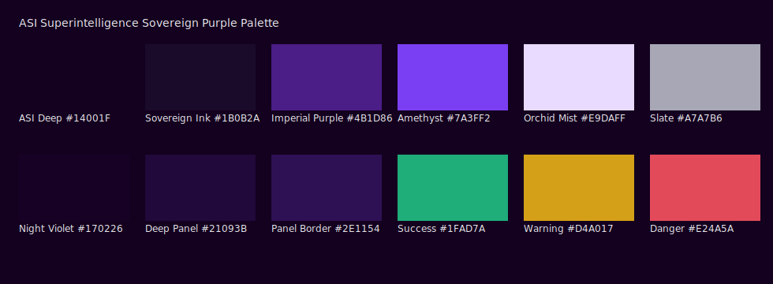
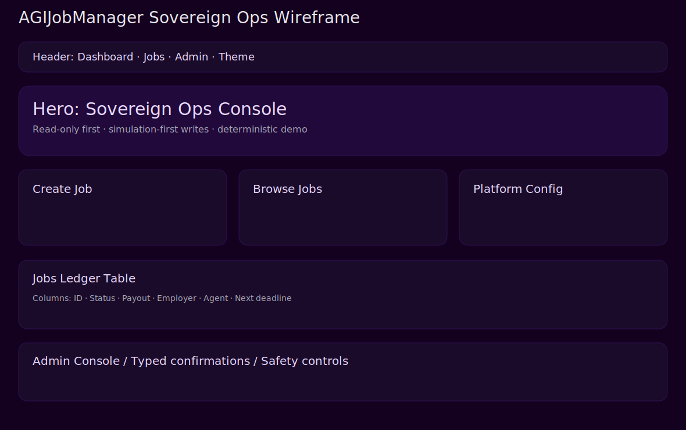
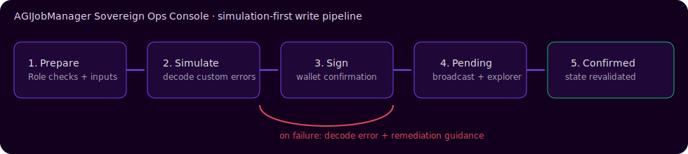

# Design System

## Palette + layout assets
- 
- 

## Token table
| Token | Role |
|---|---|
| `--background` | Main canvas |
| `--card` | Elevated panels |
| `--primary` | Sovereign action color |
| `--accent` | Focus / interactive highlight |
| `--border` | Institutional boundaries |
| `--muted-foreground` | Secondary text |

## Typography scale
| Level | Size/Line-height |
|---|---|
| H1 | 40/44 |
| H2 | 32/36 |
| H3 | 24/30 |
| Body | 16/24 |
| Small | 13/20 |

## Transaction pipeline visual

