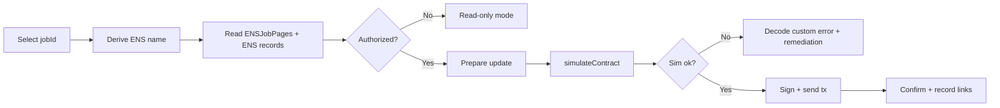

# Identity Layer Console (ENSJobPages v0.2.0)

The Sovereign Ops Console includes a dedicated `#/identity` route for ENS Job Pages operations on Ethereum mainnet.

## Intent

AGIJobManager is designed for autonomous agent workflows with human owner/operator oversight. The identity layer adds deterministic per-job naming and records for machine and human discoverability.

## Mainnet registry

- ENSJobPages: `0x703011EF1C6E4277587eFe150e6cd74cA18F0069`
- Connected AGIJobManager: `0xF8fc6572098DDcAc4560E17cA4A683DF30ea993e`
- Deployment log baseline block: `24531331`
- Root namespace: `alpha.jobs.agi.eth`
- Derived format: `job-<jobId>.alpha.jobs.agi.eth`

## Operational workflow



## Safety controls

- Read-only-first path always available without wallet.
- Writes are simulation-first and blocked in demo mode.
- Untrusted URI/text records are copy-first with scheme allowlist (`https://`, `ipfs://`, `ens://`; optional `http://` depending on settings).
- Chain mismatch, degraded RPC, and permission denial are surfaced as explicit banners.

## Agent export shape

Identity route exports deterministic JSON snapshots for autonomous agents:

```json
{
  "chainId": 1,
  "jobId": 42,
  "name": "job-42.alpha.jobs.agi.eth",
  "resolver": "0x...",
  "records": {
    "contenthash": "ipfs://...",
    "url": "https://..."
  },
  "simulateFirst": true,
  "warnings": []
}
```
